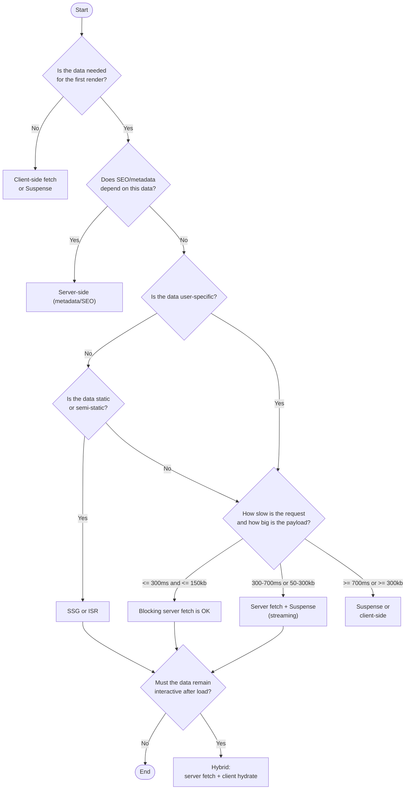

# Next.js Data Fetching Decision Tree (TTFB-First)

Use this decision tree per dataset (not per page). The goal is consistent choices, fewer performance regressions, and structured discussions in refinement and code review.

## Core Definitions

- First-render data: without it the page is content-incorrect, misleading, or effectively empty.
- User-specific data: depends on auth/session/permissions.
- Static / semi-static data: same for all users and safe to cache.
- Blocking server fetch: server-side fetch that blocks HTML and directly affects TTFB.
- Suspense: use only when the page is still content-correct without that data and the section can load independently.

## Decision Tree (Mermaid)

## Thresholds (Pragmatic Heuristics)

- If the fetch is fast and small (`<300ms` and `<150kb`), blocking it on the server is usually OK.
- If it is medium (`300-700ms` or `50-300kb`), prefer streaming with a Suspense boundary.
- If it is slow or large (`>700ms` or `>300kb`), prefer Suspense or client-side (and reconsider what must be first-render).

## Tie-Breaker

When uncertain, ask:

Can the page be content-correct without this data?

- No: treat as first-render data.
- Yes: you may defer (Suspense or client-side) based on UX and performance.
